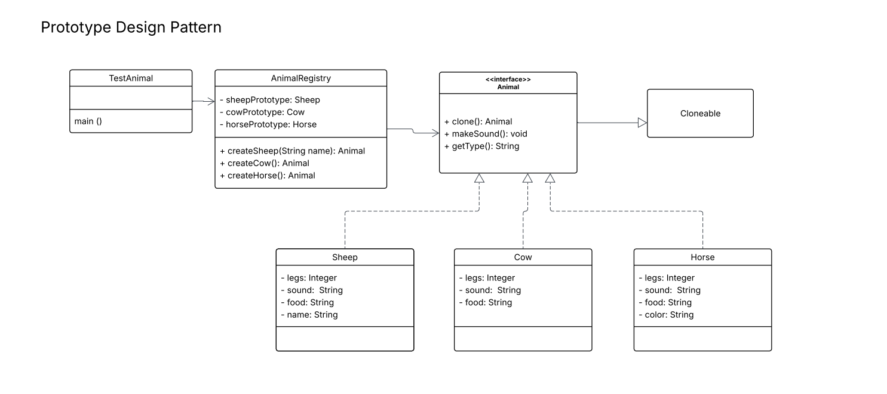

# Animal-Registry-Prototype-Design

## Overview
This project demonstrates the **Prototype Design Pattern** applied to an animal cloning system in Java. The **Prototype Pattern** is particularly useful when object creation is costly or when maintaining a registry of predefined objects improves efficiency.

## Design Structure
The system consists of the following key components:

- **`Animal` Interface (`Cloneable`)**  
  Defines the cloning behavior, ensuring that all implementing classes support object duplication.
   - clone(): Animal
   - makeSound(): void
   - getType(): String

- **Classes (`Sheep`, `Cow`, `Horse`) that implements the Animal Interface**  
    Sheep
    - legs: Integer
    - sound: String
    - food: String
    - name: String

    Cow
    - legs: Integer
    - sound: String
    - food: String

    Horse
    - legs: Integer
    - sound: String
    - food: String
    - color: String

- **`AnimalRegistry`**  
  Maintains a collection of predefined animal objects for retrieval and cloning, reducing the need for direct instantiation.
    contains:
    - sheepPrototype: Sheep
    - cowPrototype: Cow
    - horsePrototype: Horse

- **`TestAnimal`**  
  Serves as the main execution class testing the cloning functionality and registry operations.

UML Class Diagram of Prototype Design Pattern:
